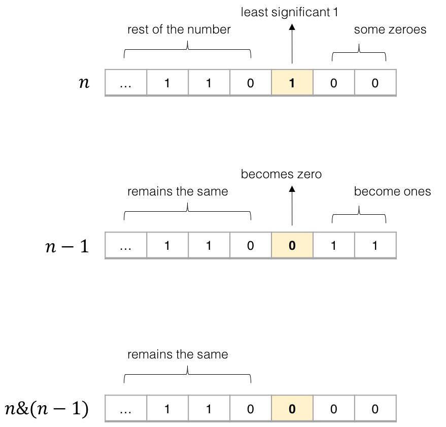

# 技巧题汇总

## 异或操作
### leetcode 136 只出现一次的数字 [位运算]
+ 简单的异或操作: 对数组中所有元素异或最后留在和里的就是只出现一次的那个
``` cpp
class Solution {
public:
    int singleNumber(vector<int>& nums) {
        int sum=0;
        for(auto x:nums)
            sum^=x;
        return sum;
    }
};
```

### leetcode 237 删除链表中的节点 [链表]
+ 只给一个链表中的节点，保证其不是尾结点，要在链表中删除它: 由于没有其前一个节点的信息，所以显然不能直接真的删除该节点。转换思路，知道当前节点，就可以去掉下一个节点，那么就把当前的节点值与下一个节点交换并去掉下一个节点即可
``` cpp
/**
 * Definition for singly-linked list.
 * struct ListNode {
 *     int val;
 *     ListNode *next;
 *     ListNode(int x) : val(x), next(NULL) {}
 * };
 */
class Solution {
public:
    void deleteNode(ListNode* node) {
        node->val = node->next->val;
        node->next = node->next->next;
    }
};
```

### leetcode 191 位1的个数 [位运算]
+ 给出1个无符号整数，求其二进制位中```1```的个数: 最直白的方法是每次```%2```看是否为```1```
``` cpp
class Solution {
public:
    int hammingWeight(uint32_t n) {
        int result = 0;
        while(n!=0){
            if(n%2==1) result += 1;
            n/=2;
        }
        return result;
    }
};
```
+ ```better```: 我们可知道，每次```i&(i-1)```会把```i```二进制表示的最后一个```1```变为```0```，因此，可以每次```&(i-1)```，如果还没为```0```说明还有```1```

``` cpp
class Solution {
public:
    int hammingWeight(uint32_t n) {
        int result = 0;
        while(n!=0){
            n&=(n-1);
            result++;
        }
        return result;
    }
};
```

### leetcode 283 移动零 [数组变换 快慢指针]
+ 简单的方法就直接多开一个```vector```，按顺序将原数组非```0```元素放入, 同时记录```0```个数，最后将```0```一次性放入最后
``` cpp
class Solution {
public:
    void moveZeroes(vector<int>& nums) {
        vector<int> result;
        int cal = 0;
        for(auto x:nums){
            if(x == 0) ++cal;
            else result.push_back(x);
        }
        while(cal--)
            result.push_back(0);
        nums = result;
    }
};
```
+ ```better```: 可以使用**快慢指针**的方法降低空间复杂度到```O(1)```, 即快指针指向当前位置，慢指针指向下一个可以被填充位置，如果当前指针指向非```0```就去填充慢指针位置。快指针到达末尾之后，慢指针一直填充```0```直到快指针的位置就行
``` cpp
class Solution {
public:
    void moveZeroes(vector<int>& nums) {
        // 慢指针
        vector<int>::iterator slow_iter = nums.begin();
        // 快指针
        vector<int>::iterator fast_iter;
        for(fast_iter = nums.begin(); fast_iter!=nums.end(); ++fast_iter){
            if(*fast_iter!=0) {
                *slow_iter = *fast_iter;
                ++slow_iter;
            }
        }
        // 慢指针补0到末尾
        while(slow_iter!=fast_iter){
            *slow_iter = 0;
            ++slow_iter;
        }
    }
};
```
+ ```best```: 上面的方法在对于```[0, 0, 0.., 1]```这样的数据会补```n-1```次```0```，然而实际上只要交换```1```次就够了。每个非```0```位置可能我们可以放到正确位置后可以马上用```0```填充(可以用交换实现)，那么之后就不用补```0```了
``` cpp
class Solution {
public:
    void moveZeroes(vector<int>& nums) {
        // 慢指针
        vector<int>::iterator slow_iter = nums.begin();
        // 快指针
        vector<int>::iterator fast_iter;
        for(fast_iter = nums.begin(); fast_iter!=nums.end(); ++fast_iter){
            if(*fast_iter!=0) {
                swap(*slow_iter, *fast_iter);
                slow_iter++;
            }
        }
    }
};
```

### leetcode 190 颠倒二进制位 [位运算、记忆化]
+ 最简单的方法就是不断直接```%2```得到二进制位重新求和构造反转出来的数
``` cpp
class Solution {
public:
    uint32_t reverseBits(uint32_t n) {
        int t = 32;             // 补执行够32次会漏掉前缀0
        uint32_t result = 0;
        while(t--){
            result = result*2 + n%2;
            n/=2;
        }
        return result;
    }
};
```
+ ```change```[多次反复查询-记忆化数组]: 如果反复查询不同数的翻转二进制，那么通过记忆化数组记忆每```8```位的翻转数可以加快速度。同时，可以通过位运算完成每```8```位的翻转。即```byte```可以通过```(byte * 0x0202020202 & 0x010884422010) % 1023```得到翻转后的数[ref:Sean Eron Anderson 的在线电子书 Bit Twiddling Hacks](http://graphics.stanford.edu/~seander/bithacks.html)
``` cpp
class Solution {
public:
    uint32_t reverseBits(uint32_t n) {
        // 记忆化数组
        map<uint32_t, uint32_t> re;
        int t = 4;
        int result = 0;
        while(t--){
            // 与操作求末八位
            int num = n & (0xff);
            if(re.find(num) == re.end()) 
                re[num] = reverseByte(num);
            result = (result<<8) + re[num];
            n >>= 8;
        }
        return result;
    }

    /*//普通转换法
    uint32_t reverseByte(uint32_t number){
        int result = 0;
        for(int i=7; i>=0; i--){
            // 通过移位计算
            result += ((number&1) << i);
            // 右移去末位
            number >>= 1;
        }
        return result;
    }*/

    //位运算
    uint32_t reverseByte(uint32_t number){
        return (number * 0x0202020202 & 0x010884422010) % 1023;
    }
};
```
+ ```change```[不用循环完成翻转]: 如果需要不用循环完成翻转，可以采用分治的思想，每次对半分，知道```1 bit```, 之后合并
``` cpp
// leetcode 官方提供
class Solution {
public:
    uint32_t reverseBits(uint32_t n) {
        n = (n >> 16) | (n << 16);
        n = ((n & 0xff00ff00) >> 8) | ((n & 0x00ff00ff) << 8);
        n = ((n & 0xf0f0f0f0) >> 4) | ((n & 0x0f0f0f0f) << 4);
        n = ((n & 0xcccccccc) >> 2) | ((n & 0x33333333) << 2);
        n = ((n & 0xaaaaaaaa) >> 1) | ((n & 0x55555555) << 1);
        return n;
    }
};
```

### 242 有效的字母异位词 [排序或者哈希]
+ 哈希：使用一个```hash```先统计较长词的各个字符次数，之后遍历较短词递减，直到某个字符无法减或者最后```hash```不空，说明不是异位词: ```O(n)```
+ 排序：简单的方法是直接两串字符排序, 再依次比较: ```O(nlogn)```

### 202 快乐数: 快慢指针 [快慢指针或者哈希]
+ 题目分析: 可能有三种情况
    + 最后得到1: 快乐数
    + 出现循环:  变成判环问题
    + 一直增加到无限大，经过分析发现，```999```的各位平方和是```243```，那么比```999```小的数各位平方和肯定超不过```243```，而```9999```是```324```，以此类推，说明增加到无限大的情况是不存在的
+ 通过```hash```记录数字是否出现过，出现过就说明出现了环
+ 快慢指针: 其实类似于链表判环问题，那么可以用**弗洛伊德循环查找算法**, 即通过快慢指针，从同一点出发，慢指针每次走```1```步，快指针每次走```2```步，如果最后相遇，说明有环，所以不是快乐数

### 268 丢失的数组 [位运算]
+ 可以先排序，通过顺序找元素```O(nlogn)```，也可以直接用哈希表记录哪些数字出现了，但是这样不是增大时间复杂度就是空间复杂度
+ ```better```: 利用两次异或同一个数字可以还原的原理，可以先求出```[0, n]```的异或和再异或数组元素，剩下的就是那个数，时间复杂度```O(n)```，也不需要额外空间
``` cpp
class Solution {
public:
    int missingNumber(vector<int>& nums) {
        int result = 0;
        for(int i=0; i<=nums.size(); i++)
            result ^= i;
        for(auto x:nums)
            result ^= x;
        return result;
    }
};
```
+ ```more```: 这里不用异或，直接求和再减去也可以

### 160 相交链表 [双指针]
+ 最暴力的方法就是遍历链表中每个节点，看在另外一个链表中会不会出现，时间复杂度: ```O(n*m)```
+ ```better```: 用一个哈希表记录```a```链表中每个节点，之后遍历```b```链表，看有没有对应节点, 时间复杂度: ```O(n+m)```
+ ```best```: 双指针，分别从```a```和```b```链表头部开始遍历，到达一个链表尾部之后，将其放到另外一个链表的头部，继续遍历，如果指针相遇的地方就是交点，如果没有交点，就会一起走到```nullptr```(解释: 第一次没有遍历时没有交点，说明一个链表到交点处比第二个链表长一点，那么交换链表后，这个长度就被补到一样了，那么就会在交点相遇或者一起到```nullptr```),时间复杂度: ```O(n+m)```
``` cpp
class Solution {
public:
    ListNode *getIntersectionNode(ListNode *headA, ListNode *headB) {
        ListNode *iter1 = headA;
        ListNode *iter2 = headB;
        while(iter1!=iter2){
            iter1 = (iter1==nullptr?headA:iter1->next);    
            iter2 = (iter2==nullptr?headB:iter2->next);
        }
        return iter1;
    }
};
```
+ 还可以先统计两个链表的长度，如果两个链表的长度不一样，就让链表长的先走，直到两个链表长度一样，这个时候两个链表再同时每次往后移一步，看节点是否一样，如果有相等的，说明这个相等的节点就是两链表的交点，否则如果走完了还没有找到相等的节点，说明他们没有交点，直接返回```nullptr```即可

### 155 最小栈 [双栈]
+ 实现一个可以常数时间获取栈中最小值的栈，同时也要有栈的```top```、```pop```、```push```操作: 关键思路就在于，对于栈来说，如果一个元素```a```在入栈时，栈里有其它的元素```b, c, d```，那么无论这个栈在之后经历了什么操作，只要```a```在栈中，```b, c, d``` 就一定在栈中，因为在```a```被弹出之前，```b, c, d```不会被弹出。因此，我们可以在每个元素```a```入栈时把当前栈的最小值```m``` 存储起来(再创建一个最小值栈)。在这之后无论何时，如果栈顶元素是```a```，我们就可以直接返回存储的最小值```m```
```cpp
class MinStack {
public:
    /** initialize your data structure here. */
    stack<int> value_stack;         // 普通栈
    stack<int> min_stack;           // 最小值栈

    MinStack() {
       
    }
    
    void push(int x) {
        value_stack.push(x);
        if(min_stack.empty() || min_stack.top() > x) min_stack.push(x);
        else min_stack.push(min_stack.top());
    }
    
    void pop() {
        value_stack.pop();
        min_stack.pop();
    }
    
    int top() {
        return value_stack.top();
    }
    
    int getMin() {
        return min_stack.top();
    }
};
```

### 101 对称二叉树[递归或迭代]
+ 如果一个树的左子树与右子树镜像对称，那么这个树是对称的，那么怎么判定左右子树镜像对称，就要
    + 根节点值相同
    + 每棵树的左子树与另一棵树的右子树镜像对称，同时其右子树与这棵树的左子树也要镜像对称
+ 因此该题目可以递归
``` cpp
// 递归方法解决
class Solution {
public:
    bool sametime_compare(TreeNode *left, TreeNode *right){
        if(!left && !right) return true;                        // 都空
        else if(!left || !right) return false;                  // 其中一个为空
        else return left->val == right->val &&                  // 根节点相同 
            sametime_compare(left->left, right->right) &&       // 左子树同右子树
            sametime_compare(left->right, right->left);         // 右子树同左子树
    }

    bool isSymmetric(TreeNode* root) {
        return sametime_compare(root, root);
    }
};
```
+ 也可以借助队列用迭代的方法解决
``` cpp
class Solution {
public:
    bool check(TreeNode *u, TreeNode *v) {
        queue <TreeNode*> q;
        q.push(u); q.push(v);
        while (!q.empty()) {
            u = q.front(); q.pop();
            v = q.front(); q.pop();
            if (!u && !v) continue;
            if ((!u || !v) || (u->val != v->val)) return false;

            q.push(u->left); 
            q.push(v->right);

            q.push(u->right); 
            q.push(v->left);
        }
        return true;
    }

    bool isSymmetric(TreeNode* root) {
        return check(root, root);
    }
};
```

### 53 最大子序和[动态规划或分治]
+ 简单的动态规划，到每个位置的最大和是前面的和或者```0```的最大值(```max(pre_sum, 0)```)加上当前位置的值
+ 这道题也可以用分治的方法解决，但是时间复杂度不变编码更为复杂，
    + 其主要思想: 对于一个区间```[l, r]```，我们维护四个量：
        + lSum 表示```[l, r]```内以```l```为左端点的最大子段和
        + rSum 表示```[l,r] ```内以```r```为右端点的最大子段和
        + mSum 表示```[l, r]```内的最大子段和
        + iSum 表示```[l, r]```的区间和
    + 四个变量的计算方式:
        + 区间```[l, r]```的```iSum```就等于「左子区间」的```iSum```加上「右子区间」的```iSum```。
        + 对于```[l, r]```的```lSum```，存在两种可能，它要么等于「左子区间」的```lSum```，要么等于「左子区间」的```iSum```加上「右子区间」的```lSum```，二者取大。
        + 对于 ```[l, r]```的```rSum```，同理，它要么等于「右子区间」的```rSum```，要么等于「右子区间」的```iSum```加上「左子区间」的```rSum```，二者取大。
        + 当计算好上面的三个量之后，就很好计算```[l, r]```的```mSum```了。我们可以考虑```[l, r]```的```mSum```对应的区间是否跨越```m```——它可能不跨越```m```，也就是说```[l, r]```的```mSum```可能是「左子区间」的```mSum``` 和「右子区间」的```mSum```中的一个；它也可能跨越```m```，可能是「左子区间」的```rSum```和 「右子区间」的```lSum```求和。三者取大。
    + 分治法题解来源于[Leetcode](https://leetcode-cn.com/problems/maximum-subarray/solution/zui-da-zi-xu-he-by-leetcode-solution/)

### 26 删除排序数组中的重复项[双指针]
+ 用快慢指针,```slow```和```fast```(可以用下标模拟),如果```fast```指向的值等于```slow```，说明重复区间未结束，增加```fast```跳过，相反则结束了，把```fast```指向的值给```slow+1```
``` cpp
class Solution {
public:
    int removeDuplicates(vector<int>& nums) {
        if(nums.size() == 0) return 0;
        int slow = 0, fast = 1;
        while(fast < nums.size()){
            if(nums[slow] == nums[fast]) ++fast;
            else nums[++slow] = nums[fast++];
        }
        return slow + 1;
    }
};
```

### 88 合并两个有序数组
+ 如果按照从前往后的方法，显然每次```nums2```的数放到```nums1```就要移动```nums1```对应位置后的所有元素。由于保证```nums1```的空间已经开辟了```n+m```，那么从```n+m-1```开始往前，每次选取两数组里最大的数放进```nums1```后面，就无需挪动，由于到```nums1```实际有值的地方时，该值肯定应该在后面，或者当前位置，因此直接覆盖，不影响
``` cpp
class Solution {
public:
    void merge(vector<int>& nums1, int m, vector<int>& nums2, int n) {
        int tail=m+n-1,tail1=m-1,tail2=n-1;
        while(tail!=tail1)                          // 跳出说明剩下的都是nums1里的了
        {
            if(tail1>=0 && nums1[tail1]>nums2[tail2]) nums1[tail--]=nums1[tail1--];
            else nums1[tail--]=nums2[tail2--];
        }
    }
};
```

### 234 回文链表
+ 简单的方法是开一个数组，存下链表从前往后的内容，之后在数组前后各往中间移动看是不是回文串，但是空间复杂度是```O(n)```
+ 通过递归，即找到末尾，之后往上回溯时和全局头指针逐步往后进行比较，也可以，但事实上空间复杂度也是```O(n)```
+ ```better```:空间复杂度为```O(1)```的做法是将后面部分的链表先倒过来，然后比较两段，可以用快慢指针，一个一次走一步一个两步找到中间位置。不过实际项目开发中，一来是要记得倒过来，二来是如果是多线程，那么对于其他同时访问该链表的线程就有点问题了

### 172 阶乘后的零[数字分解]
+ 找阶乘中的数字包含几个```10```以及```5```和```2```的对数，因为```0```只能由```10```和```2*5```产生
+ ```better```:(1) 实际上```10```也是由```2```和```5```构成的，所以其实只要找```2```和```5```的对数就行了。再进一步思考，```2```的个数永远比```5```多，所以实际上只要算```5```的个数就行了
``` cpp
class Solution {
public:
    int trailingZeroes(int n) {
        int result = 0;
        // 而且只有5的倍数才可能包含5,因此只要遍历5的倍数就好
        for(int i=5; i<=n; i+=5){
            int mid = i;
            while(mid%5==0){
                ++result;
                mid/=5;
            }
        }
        return result;    
    }
};
```
+ ```best```:(1)由上面思路，我们可以转换为求有多少```5```的倍数，```25```的倍数，```125```的倍数```...```,我们可以对```n```分别除```5```的幂，得到的个数事实上就是```1-n```包含的该```5```的幂的个数。(2)同时，类似```25```，有2个```5```,但是在除```5```算过一次，因此只用再算1次。总而言之，结果就是```n/5+n/25+...n/(5^i)```
``` cpp
class Solution {
public:
    int trailingZeroes(int n) {
        int result = 0;
        int five_power = 5;
        while(n >= five_power){
            result += n/five_power;             // 求包含的5,25,125...的个数
            five_power *= 5;
        }
        return result;    
    }
};
```

### 28 实现```strStr()```[```Rabin Karp```]
+ 最简单的方法是主串从前往后，尝试与子串匹配，第```1```个字符相同就比第```2```个、第```3```个```...```,不同就回过头去重新重头开始，时间复杂度```O(M*N)```(即两字符串长度之积)
+ ```better```: 为了在子串存在很多重复字符时，可以不用每次从头开始匹配的情况，可以考虑用```kmp```
+ ```best```: 用```Rabin Karp```可以做到```O(n)```，因为是小写字母，只有```26```种可能，因此可以用```26```进制数来唯一表示一串数字，即得到一串字符的哈希值。如果子串和主串中的某一段哈希值相同，说明相同。那么以子串长度为窗口长度，从主串最左边开始，每次计算窗口的哈希值并与子串比较，不行就将窗口向右移动一位。同时，可以用滚动哈希方法，减去最高位加上新的位，来得到新的窗口的哈希值，因此整体时间复杂度就是```O(n)```(```n```为主串长度)。但是这种方法有个问题，哈希值计算会超过```int```范围，因此应该中间取模，但可能造成哈希冲突(不同字符串在取模情况下可能会有相同哈希值)(题目中不处理也能通过)，所以应该在哈希值相同时再比较一下字符串保证正确
``` cpp
class Solution {
public:
    int strStr(string haystack, string needle) {
        int window_len = needle.size();
        long long hash_needle = 0, hash_haystack = 0;
        // mod的值取2^30，取其它也没所谓
        long long mod = pow(2, 30);
        
        for(int i=0; i<window_len; i++) {
            hash_needle = hash_needle * 26 % mod + (needle[i] - 'a');
            hash_haystack = hash_haystack * 26 % mod + (haystack[i] - 'a');
        }
        long long top_pos = 1;
        for(int i=1; i<=window_len-1; i++)
            top_pos = top_pos * 26 % mod;

        if(hash_needle == hash_haystack) return 0;
        for(int i=window_len; i<haystack.size(); i++) {
            // + mod 避免负数
            hash_haystack = ((hash_haystack - (haystack[i-window_len]-'a') * top_pos + mod) % mod * 26
                                + (haystack[i] - 'a')) % mod;
            // 在哈希值相同时应该比较一下子串，因为可能会有哈希冲突的情况出现
            if(hash_haystack == hash_needle) return i - window_len + 1; 
        }
        return -1;
    }      
};
```

### 69 ```x```的平方根[牛顿迭代法]
+ 最简单的做法就是遍历从```1```开始求平方，如果大于```x```,说明其平方根的整数位就是当前数减去```1```
+ ```better```: 遍历的速度有点慢，可以使用二分查找```O(log(n))```
+ ```other```: 求```x```的平方根可以转换成求```ln```和```exp```

但同时，由于浮点数有误差，因此求得整数部分结果如```a```要判断一下是```a```还是```a+1```
+ ```other```:牛顿迭代法-是一种可以用来快速求解函数零点的方法，具体看```Leetcode```中对应题目的官方题解

### 78 子集[二进制回溯或递归]
+ 可以通过枚举二进数的方法，来枚举集合的子集，```1```表示选中对应元素，```0```表示不选中
``` cpp
class Solution {
public:
    vector<vector<int>> subsets(vector<int>& nums) {
        vector<vector<int>> result;
        const long long UP_BOUND = pow(2, nums.size());         // 5个元素则从00000枚举到11111
        for(int i=0; i<UP_BOUND; i++){
            int mid = i;
            vector<int> subset;
            for(int j=0; j<nums.size(); j++){                   // 固定遍历次数，因为没有也要输出0
                if(mid % 2) subset.push_back(nums[j]);          // better:其实也不用固定，0的话就说明剩下的不用加入了
                mid/=2;                                         // 循环出补充为for(int j=0; j<nums.size() && mid; j++)即可
            }                                                   // 当然可以通过异或的方式枚举
            result.push_back(subset);
        }
        return result;
    }
};
```
+ other: 也可以用递归的方法
``` cpp
class Solution {
public:
    vector<vector<int>> results;
    vector<int> res;

    void dfs(int step, vector<int>& nums){
        if(step == nums.size()) {
            results.push_back(res);
            return;
        }
        // 放入，有nums[step]的版本
        res.push_back(nums[step]);
        dfs(step + 1, nums);
        
        // 拿出，无nums[step]的版本
        res.pop_back();
        dfs(step + 1, nums);
    }
    vector<vector<int>> subsets(vector<int>& nums) {
        dfs(0, nums);
        return results;
    }
};
```

## 46 全排列[递归]
+ 类似78的思想，通过递归就可以解决
``` cpp
class Solution {
public:
    vector<vector<int>> results;
    vector<int> res;
    vector<bool> ma;            // 记录是否使用过的数组

    void dfs(int step, vector<int>& nums) {
        if(step == nums.size()) {
            results.push_back(res);
            return;
        }
        for(int i=0; i<nums.size(); i++) {
            if(!ma[i]) {
                res.push_back(nums[i]);        // 尝试在step处放nums[i]
                ma[i] = true;
                dfs(step+1, nums);
                res.pop_back();
                ma[i] = false;
            }
        }
    }

    vector<vector<int>> permute(vector<int>& nums) {
        for(int i=0; i<nums.size(); i++)
            ma.push_back(false);
        dfs(0, nums);
        return results;
    }
};
```

## 22 括号生成[递归]
+ 从```dfs(left_brace, right_brace)```开始每次尝试放左括号```dfs(left_brace-1, right_brace)```或者右括号```dfs(left_brace, right_brace-1)```，只要注意有足够数量的左括号情况下才能放右括号即可
``` cpp
class Solution {
public:
    std::vector<std::string> results; 
    std::string res;
    void dfs(int left_brace, int right_brace) {
        if(left_brace == 0 && right_brace == 0){
            results.push_back(res);
            return;
        }
        if(left_brace >= 0){
            res.push_back('(');
            dfs(left_brace-1, right_brace);
            res.pop_back();
        }
        if(right_brace > left_brace){
            res.push_back(')');
            dfs(left_brace, right_brace-1);
            res.pop_back();
        }
    }

    vector<string> generateParenthesis(int n) {
        dfs(n, n);
        return results;
    }
};
```
+ better: 通过```generate(n)```表示长度为```2*n```的字符串可能的括号序列数量，其第一个必然是个左括号，所以只要枚举右括号的位置即可```(a)b```,那么事实上只要组合```a```的可能```generate(i)```和```b```的可能```generate(n-1-i)```,以此递归下去。同时这样就可以用记忆化数组，来存储```generate(i)```的可能结果，避免重复枚举
```cpp
// leetcode-22 题解: 方法三
// 链接：https://leetcode-cn.com/problems/generate-parentheses/solution/gua-hao-sheng-cheng-by-leetcode-solution/
```

## 289 生命游戏[模拟]
+ 使用一个额外数组记录改变后的状态，避免影响还没改的位置，之后赋值回原数组
+ better: 建立除```0```和```1```之外的中间状态，例如```2```代表原来是```1```现在是```0```,```3```代表原来是```0```现在是```1```,不需额外数组就能完成修改，最后再处理一次把```2```和```3```变为其最终状态
``` cpp
class Solution {
public:
    void gameOfLife(vector<vector<int>>& board) {
        int xdir[] = {0, 0, 1, 1, 1, -1, -1, -1};
        int ydir[] = {1, -1, 0, 1, -1, 0, 1, -1};
        for(int i=0; i<board.size(); i++){
            for(int j=0; j<board[i].size(); j++){
                int count = 0;
                // 统计周围存活细胞数目
                for(int k=0; k<8; k++){
                    if(i+xdir[k]>=0 && i+xdir[k]>=0 && j+ydir[k]<board[i].size() && 
                        i+xdir[k]<board.size() && (board[i+xdir[k]][j+ydir[k]] == 1 || board[i+xdir[k]][j+ydir[k]] == 2))
                            count++;
                }
                // 2: 原来1现在0                  3: 原来0现在1
                if(board[i][j] == 1 && (count<2 || count>3)) board[i][j] = 2;
                else if(board[i][j] == 0 && count == 3) board[i][j] = 3;
            }
       }
       // 重新处理一次,把2和3的改为该有的状态
       for(int i=0; i<board.size(); i++){
            for(int j=0; j<board[i].size(); j++){
                if(board[i][j] == 2) board[i][j] = 0;
                else if(board[i][j] == 3) board[i][j] = 1;
            }
       }
    }
};
```
## 144 二叉树的后序遍历
+ 详情见```acm2020```中二叉树相关总结
    + 递归
    + 迭代(栈)
    + ```Morris```遍历

## 94 二叉树的中序遍历
+ 详情见```acm2020```中二叉树相关总结
    + 递归
    + 迭代(栈)
    + ```Morris```遍历

## 145 二叉树的后序遍历
+ 详情见```acm2020```中二叉树相关总结
    + 递归
    + 迭代(栈)
    + ```Morris```遍历

## 230 二叉搜索树中第K小的元素
+ 中序遍历中的第```k```个数就是二叉搜索树中第```k```小的那个
+ ```extend```: 如果经常在二叉搜索树插入删除元素，并多次查询第```k```小，可以先进行一次中序遍历，维护一个哈希表，表示每个节点左子树加上本身有多少节点。查询的时候，如果```k```大于当前节点的位置，就往右走，并将```k```减去当前值，否则往左走。当插入元素时，如果往左，就更新经过的节点的哈希表加```1```，因为左子树多了一个元素，如果删除，则相反。
```cpp
class Solution {
public:
    int num = 0;
    unordered_map<TreeNode*, int> order;
    // 中序遍历维护一个记录左节点和自身一共包含多少个节点的Map
    int inorder_tree(TreeNode* root) {
        int left_num, right_num;
        // 左边节点个数
        if(root->left) left_num = inorder_tree(root->left);
        else left_num = 0;
        // 左边与本身节点个数
        order[root] = left_num + 1;
        // 右边节点个数
        if(root->right) right_num = inorder_tree(root->right);
        else right_num = 0;
        return left_num + right_num + 1;
    }

    int kthSmallest(TreeNode* root, int k) {
        inorder_tree(root);             // 预处理
        while(order[root] != k){        // 相同说明找到了
            if(order[root] > k) { 
                root = root->left;      // k比order[root]小，往左走
            }
            else {                      // k比order[root]大，往右走并减去对应值
                k -= order[root];         
                root = root->right;     // 注意不要和上一句位置反了
            }
        }
        return root->val;
    }
};
```

## 238 除自身以外数组的乘积[连续积]
+ 题目说了不能用除法，那么最简单的是对从左遍历一次，得到每个位置左边的乘积```left_mul[i]```，再从右边遍历一次，得到每个位置右边的乘积```right_mul[i]```,每个位置的结果就是左边乘以右边即```left_mul[i] * right_mul[i] ```
```cpp
class Solution {
public:
    vector<int> productExceptSelf(vector<int>& nums) {
        vector<int> results;
        vector<int> left_mul(nums.size()), right_mul(nums.size());
        // 记录左边乘积
        left_mul[0] = 1;
        for(int i=1; i<nums.size(); i++)
            left_mul[i] = left_mul[i-1] * nums[i-1];
        // 记录右边乘积
        right_mul[nums.size()-1] = 1;
        for(int i=nums.size()-2; i>=0; i--)
            right_mul[i] = right_mul[i+1] * nums[i+1];
        // 结果就是左乘右
        for(int i=0; i<nums.size(); i++)
            results.push_back(left_mul[i] * right_mul[i]);
        return results;
    }
};
```
+ better: 上面的方法空间复杂度较高，因为要两个数组分别存左乘积和右乘积，事实上右乘积可以动态构造，从尾部开始计算答案```left_mul[i] * R```,然后就```R *= nums[i]```,继续计算```left_mul[i-1] * R```,依此类推
``` cpp
class Solution {
public:
    vector<int> productExceptSelf(vector<int>& nums) {
        vector<int> left_mul(nums.size()); 
        // 计算左乘积
        left_mul[0] = 1;
        for(int i=1; i<nums.size(); i++)
            left_mul[i] = left_mul[i-1] * nums[i-1];
        
        // 计算结果
        int R = 1;
        for(int i=nums.size()-1; i>=0; i--){
            left_mul[i] *= R;
            R *= nums[i];
        }
        return left_mul;
    }
};
```