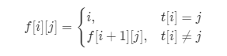

# leetcode 1025 除数博弈

## 题目描述
给定字符串```s```和```t```，判断```s```是否为```t```的子序列。你可以认为```s```和```t```中仅包含英文小写字母。字符串```t```可能会很长（长度 ~= 500,000），而```s```是个短字符串（长度 <=100）。
字符串的一个子序列是原始字符串删除一些（也可以不删除）字符而不改变剩余字符相对位置形成的新字符串。（例如，"ace"是"abcde"的一个子序列，而"aec"不是）

后续挑战 :
如果有大量输入的 S，称作S1, S2, ... , Sk 其中 k >= 10亿，你需要依次检查它们是否为 T 的子序列。在这种情况下，你会怎样改变代码？

## 题目思路

### 暴力+贪心
+ 对小序列从左到右，在大序列中找对应，每次尽量匹配靠前的位置(相当于贪心)
```
class Solution {
public:
    bool isSubsequence(string s, string t) {
        int i=-1;
        for(auto x:s){
            i++;
            for(;i<t.size();++i){
                if(x==t[i]){
                    break;
                }
            }
        }
        // 添加特判
        if(s.size()==0||i<t.size()) return true;
        else return false;
    }
};
```


## 其他人思路
###  很好的思路-**动态规划**
考虑前面的做法，我们注意到我们有大量的时间用于在```t```中找到下一个匹配字符这样我们可以预处理出对于```t```的每一个位置，从该位置开始往后每一个字符第一次出现的位置。我们可以使用动态规划的方法实现预处理，令```f[i][j]```表示字符串```t```中从位置```i```开始往后字符 ```j``` 第一次出现的位置。在进行状态转移时，如果```t```中位置```i```的字符就是```j```，那么```f[i][j]=if[i][j]=i```，否则```j```出现在位置```i+1```开始往后，即```f[i][j]=f[i+1][j]```，因此我们要倒过来进行动态规划，从后往前枚举```i```

这样我们可以写出状态转移方程：

 

假定下标从0开始，那么```f[i][j]```中有 0 \leq i \leq m-10≤i≤m−1 ，对于边界状态``` f[m-1][..]```，我们置```f[m][..]```为```m```，让``` f[m-1][..]```正常进行转移。这样如果```f[i][j]=m```，则表示从位置 ```i```开始往后不存在字符```j```。

这样，我们可以利用```f```数组，每次```O(1)```地跳转到下一个位置，直到位置变为```m```或```s```中的每一个字符都匹配成功。

同时我们注意到，该解法中对```t```的处理与```s```无关，且预处理完成后，可以利用预处理数组的信息，线性地算出任意一个字符串```s```是否为```t```的子串。这样我们就可以解决「后续挑战」啦。
