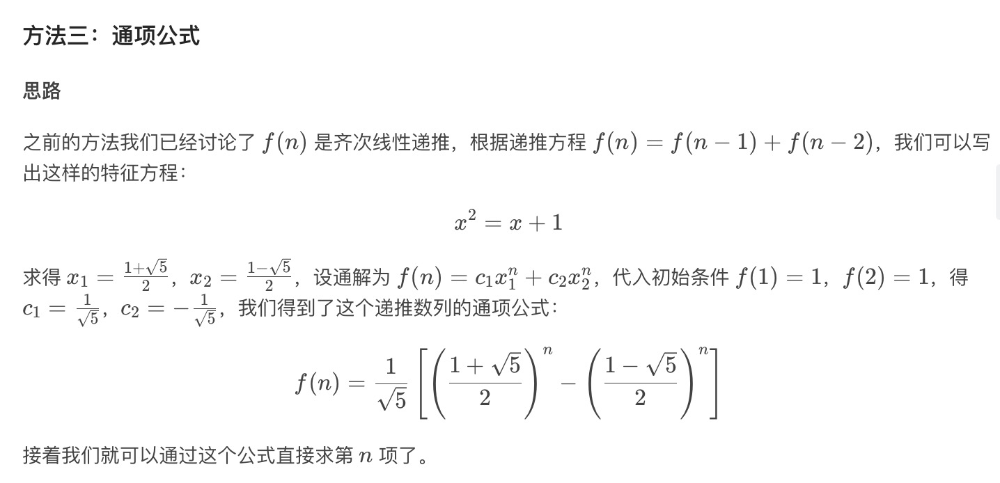

# Leetcode 70 爬楼梯

### 题目描述
假设你正在爬楼梯。需要 n 阶你才能到达楼顶。
每次你可以爬 1 或 2 个台阶。你有多少种不同的方法可以爬到楼顶呢？
注意：给定 n 是一个正整数。

示例 1：
```
输入： 2
输出： 2
解释： 有两种方法可以爬到楼顶。
1.  1 阶 + 1 阶
2.  2 阶
```
示例 2：
```
输入： 3
输出： 3
解释： 有三种方法可以爬到楼顶。
1.  1 阶 + 1 阶 + 1 阶
2.  1 阶 + 2 阶
3.  2 阶 + 1 阶
```

### 解题思路

#### 简单动态规划
+ 可以直接dp推导,```dp[i] = d[i-1] + dp[i-2]```,可以滚动数组节省空间
+ 时间复杂度:```O(n)``` 空间复杂度:```O(1)```

#### 矩阵快速幂
+ 可以推出：
```
[f(n) f(n-1)] = [f(n-1) f(n-2)] * [[1 1],[1 0]]
```
+ 那么就有
```
[f(n) f(n-1)] = [f(1) f(0)] * [[1 1],[1 0]]^(n-1)
```
+ 后面的幂部分使用矩阵快速幂，时间复杂度为```O(log(n))```
+ 总的时间复杂度:```O(log(n))``` 空间复杂度:```O(1)```
#### 推出通项公式


### 代码

```cpp
class Solution {
public:
    int climbStairs(int n) {
        if(n==1) return 1;
        vector<int> dp(n, 0);
        dp[0] = 1;
        dp[1] = 2;
        for(int i=2;i<n;i++){
            dp[i] = dp[i-1] + dp[i-2];
        }
        return dp[n-1];
    }
};
```